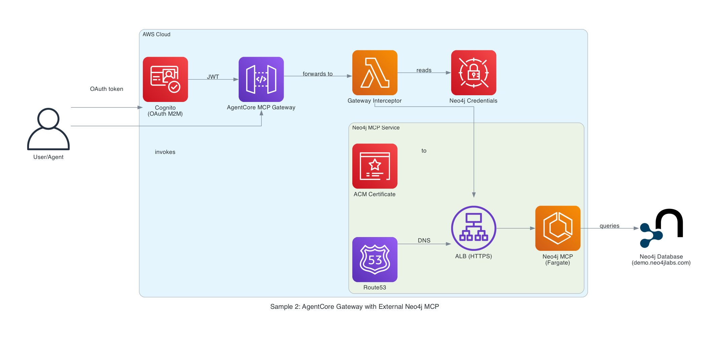

# Sample 2: AWS AgentCore Gateway with External Neo4j MCP via Fargate

## Introduction

This sample demonstrates how to use AWS AgentCore Gateway to connect to external Neo4j MCP servers running on AWS Fargate. The stack provisions a minimal Amazon Cognito OAuth setup for machine-to-machine (`client_credentials`) authentication, and uses a **Lambda Interceptor** to translate OAuth tokens into Neo4j credentials so you can run the **official Neo4j MCP server** in HTTP mode.

**Key Features:**

- **AgentCore Gateway**: Enterprise tool governance and centralized MCP management
- **Lambda Request Interceptor**: Translates OAuth tokens to Neo4j Basic Auth headers
- **Official Neo4j MCP**: Uses unmodified official Docker image in HTTP mode
- **ECS Fargate Deployment**: Serverless container orchestration
- **Built-in Cognito OAuth**: Secure M2M authentication for external clients

**Use Cases:**

- Enterprise deployments using official vendor-supported images
- Centralized identity management with OAuth 2.0
- Secure credential injection at the edge (Gateway) rather than in containers
- High availability architecture with public load balancers

## Architecture Design



### Components

1. **AWS AgentCore Gateway**
   - Reverse proxy for MCP servers
   - Inbound JWT validation using Cognito OIDC discovery (`CUSTOM_JWT`)
   - Lambda Interceptor execution (REQUEST interception point)

2. **Gateway Target**
   - Registers the Neo4j MCP ALB as an MCP server target
   - Automatically linked to the Gateway via `gateway_identifier`

3. **Request Interceptor Lambda**
   - Executes before request reaches backend
   - Retrieves Neo4j credentials from Secrets Manager
   - Replaces OAuth `Authorization` header with `Basic <user:pass>`

4. **Application Load Balancer (Public, HTTPS)**
   - Terminates TLS using an ACM certificate
   - Custom domain registered via Route53 A-record alias
   - Distributes traffic to Fargate tasks on port 443

5. **Neo4j MCP Container (Official)**
   - Runs `mcp/neo4j:latest` image
   - Configured in HTTP mode (`NEO4J_TRANSPORT_MODE=http`)
   - Stateless authentication via per-request Basic Auth

6. **AWS Secrets Manager**
   - Stores Neo4j credentials
   - Accessed by Interceptor Lambda for header injection

## In-Depth Analysis

### Authentication Flow (Token Exchange)

The core innovation in this pattern is the **Auth Interceptor** that enables compatibility between OAuth-based Gateway clients and Basic Auth-based Neo4j MCP.

```
External Agent (OAuth Token)
    ↓
[OAuth Validation - Cognito User Pool (created by stack)]
    ↓
AgentCore Gateway
    ↓
Request Interceptor Lambda
    ├─ Retrieve Secret ("neo4j/creds")
    ├─ Compute Basic Auth Header
    └─ Replace "Authorization" Header
    ↓
[Basic Auth: neo4j:password]
    ↓
Application Load Balancer (Public)
    ↓
Official Neo4j MCP (HTTP Mode)
```

**Benefits:**

- **Security**: Neo4j credentials never exposed to client
- **Compliance**: Uses standard OAuth patterns for clients
- **Simplicity**: Backend uses stateless, standard HTTP auth

### Fargate Service Architecture

**Neo4j MCP Service:**

- Image: `mcp/neo4j:latest`
- Environment variables:
  - `NEO4J_TRANSPORT_MODE`: `http`
  - `NEO4J_MCP_HTTP_PORT`: `8080`
  - `NEO4J_MCP_HTTP_HOST`: `0.0.0.0`
  - `NEO4J_READ_ONLY`: `true`
- Secrets (from Secrets Manager):
  - `NEO4J_URI`, `NEO4J_DATABASE`

### Load Balancer Configuration

AgentCore Gateway requires HTTPS endpoints for MCP target registration, so the ALB is configured with a TLS listener and a custom domain:

- **Listeners**: HTTPS:443 (ACM certificate attached)
- **Custom Domain**: `<subdomain>.<domain_name>` — Route53 A-record alias created automatically by CDK
- **Target Groups**: IP-mode targets for Fargate tasks
- **Health Check**: `/mcp` endpoint, codes `200-499`
- **Security Groups**: Allow inbound from AgentCore Gateway IP ranges (optional hardening)

### Domain and Certificate Configuration

The stack reads three CDK context variables:

| Context key       | Default      | Description                                                                                                        |
| ----------------- | ------------ | ------------------------------------------------------------------------------------------------------------------ |
| `domain_name`     | _(required)_ | Apex domain of an existing Route53 hosted zone (e.g. `example.com`)                                               |
| `subdomain`       | `mcp`        | Subdomain prefix — results in `mcp.example.com`                                                                   |
| `certificate_arn` | _(required)_ | ARN of an existing ACM certificate covering the FQDN (e.g. `arn:aws:acm:us-east-1:123456789012:certificate/...`) |

The Cognito hosted domain prefix is generated automatically as `neo4j-mcp-<account>-<region>`.

The certificate is imported by ARN (`from_certificate_arn`) and must reside in the same region as the stack.

## How to Use This Example

### Prerequisites

- AWS Account with Bedrock, ECS, and AgentCore access
- AWS CLI and CDK installed
- Neo4j database (or use the default Neo4j Demo Database)
- A Route53 public hosted zone for your domain already configured in your AWS account
- An ACM certificate in the deploy region covering `<subdomain>.<domain_name>` (or a matching wildcard) — copy its ARN from the ACM console
- No pre-existing Cognito setup is required; this stack creates User Pool, app client, and hosted domain

### Step 1: Clone the Repository

```bash
git clone https://github.com/neo4j-labs/neo4j-agent-integrations.git
cd neo4j-agent-integrations/aws-agentcore/samples/2-gateway-external-mcp
```

### Step 2: Install Dependencies

```bash
pip install -r requirements.txt
```

### Step 3: Configure Your Domain

Open `cdk.json` and fill in your domain details under the `context` key:

```json
{
  "context": {
    "domain_name": "example.com",
    "subdomain": "mcp",
    "certificate_arn": "arn:aws:acm:us-east-1:123456789012:certificate/xxxxxxxx-xxxx-xxxx-xxxx-xxxxxxxxxxxx"
  }
}
```

### Step 4: Deploy Infrastructure

```bash
# Bootstrap CDK (first time only)
cdk bootstrap

# Deploy the stack
cdk deploy Neo4jAgentCoreGatewayStack \
  -c domain_name=example.com \
  -c subdomain=mcp \
  -c certificate_arn=arn:aws:acm:us-east-1:123456789012:certificate/xxxxxxxx-xxxx-xxxx-xxxx-xxxxxxxxxxxx
```

**Stack Resources Created:**

- VPC with public subnets
- ECS Cluster and Fargate Service (Neo4j MCP)
- Public Application Load Balancer (HTTPS/443, ACM cert attached)
- Route53 A-record alias → ALB (`<subdomain>.<domain_name>`)
- Lambda Interceptor Function
- Secrets Manager Secret (Neo4j credentials)
- Amazon Cognito User Pool, hosted domain, resource server scope, and app client
- IAM Roles (Fargate task, Lambda, Gateway)
- AgentCore MCP Gateway
- Gateway Target to Neo4j MCP (using custom domain endpoint)

**Stack Outputs:**

| Output                 | Description                                           |
| ---------------------- | ----------------------------------------------------- |
| `McpFqdn`              | Custom domain for the Neo4j MCP Service               |
| `McpServiceUrl`        | HTTPS URL of the Neo4j MCP Service                    |
| `Neo4jSecretArn`       | ARN of the Neo4j credentials secret                   |
| `InterceptorLambdaArn` | ARN of the Request Interceptor Lambda                 |
| `GatewayArn`           | ARN of the AgentCore MCP Gateway                      |
| `GatewayUrl`           | URL of the AgentCore MCP Gateway                      |
| `CognitoUserPoolId`    | Cognito User Pool ID used by the gateway authorizer   |
| `CognitoAppClientId`   | Cognito app client ID for OAuth client credentials    |
| `CognitoDiscoveryUrl`  | OIDC discovery URL configured in gateway authorizer   |
| `CognitoTokenEndpoint` | Cognito token endpoint for client credentials flow    |
| `CognitoScope`         | Required scope for gateway calls (`neo4j-mcp-gateway/invoke`) |

### Step 5: Test with the Demo Notebook (optional)

Open [demo.ipynb](demo.ipynb) in Jupyter or VS Code. Set `STACK_NAME` to your stack name, then run the cells to obtain an OAuth token from Cognito and call the Gateway (list tools, call Neo4j MCP tools). Requires `requests` and AWS credentials.

### Step 6: Get OAuth Token and Test Integration (CLI)

1. **Verify DNS**: The Route53 alias record should resolve to the ALB immediately after deploy.
   ```bash
   dig mcp.example.com
   ```
2. **Check HTTPS**: Confirm the MCP endpoint responds over TLS.
   ```bash
   curl https://mcp.example.com/mcp
   ```
3. **Read stack outputs**:
   ```bash
   STACK_NAME=Neo4jAgentCoreGatewayStack

   GATEWAY_URL=$(aws cloudformation describe-stacks \
     --stack-name "$STACK_NAME" \
     --query "Stacks[0].Outputs[?OutputKey=='GatewayUrl'].OutputValue" \
     --output text)

   COGNITO_USER_POOL_ID=$(aws cloudformation describe-stacks \
     --stack-name "$STACK_NAME" \
     --query "Stacks[0].Outputs[?OutputKey=='CognitoUserPoolId'].OutputValue" \
     --output text)

   COGNITO_CLIENT_ID=$(aws cloudformation describe-stacks \
     --stack-name "$STACK_NAME" \
     --query "Stacks[0].Outputs[?OutputKey=='CognitoAppClientId'].OutputValue" \
     --output text)

   COGNITO_TOKEN_ENDPOINT=$(aws cloudformation describe-stacks \
     --stack-name "$STACK_NAME" \
     --query "Stacks[0].Outputs[?OutputKey=='CognitoTokenEndpoint'].OutputValue" \
     --output text)

   COGNITO_SCOPE=$(aws cloudformation describe-stacks \
     --stack-name "$STACK_NAME" \
     --query "Stacks[0].Outputs[?OutputKey=='CognitoScope'].OutputValue" \
     --output text)
   ```
4. **Retrieve Cognito app client secret**:
   ```bash
   COGNITO_CLIENT_SECRET=$(aws cognito-idp describe-user-pool-client \
     --user-pool-id "$COGNITO_USER_POOL_ID" \
     --client-id "$COGNITO_CLIENT_ID" \
     --query "UserPoolClient.ClientSecret" \
     --output text)
   ```
5. **Request OAuth token** (`client_credentials`):
   ```bash
   OAUTH_TOKEN=$(curl -s -X POST "$COGNITO_TOKEN_ENDPOINT" \
     -H "Content-Type: application/x-www-form-urlencoded" \
     --data-urlencode "grant_type=client_credentials" \
     --data-urlencode "client_id=$COGNITO_CLIENT_ID" \
     --data-urlencode "client_secret=$COGNITO_CLIENT_SECRET" \
     --data-urlencode "scope=$COGNITO_SCOPE" \
     | python3 -c 'import json,sys; print(json.load(sys.stdin)["access_token"])')
   ```
6. **Call Gateway**:
   ```bash
   curl -X POST "$GATEWAY_URL" \
     -H "Authorization: Bearer $OAUTH_TOKEN" \
     -H "Content-Type: application/json" \
     -d '{"jsonrpc":"2.0","id":"list-tools-request","method":"tools/list"}'
   ```
7. **Verify Flow**:
   - Gateway validates token
   - Interceptor swaps token for Basic Auth
   - Neo4j MCP accepts request and returns schema

### Troubleshooting

- `invalid_client`: confirm `COGNITO_CLIENT_ID` and `COGNITO_CLIENT_SECRET` were taken from the same `CognitoUserPoolId`.
- `insufficient_scope`: ensure token request includes `scope=$COGNITO_SCOPE` exactly as returned by stack outputs.
- Unauthorized response from gateway: verify the token is unexpired and issued by this stack's `CognitoDiscoveryUrl`.

### Step 7: Clean Up

```bash
cdk destroy Neo4jAgentCoreGatewayStack
```

> **Note:** The stack does **not** delete your Route53 hosted zone or ACM certificate — those are looked up from existing resources and left untouched.

## References

### AWS Documentation

- [AgentCore Gateway Requests Interceptors](https://docs.aws.amazon.com/bedrock-agentcore/latest/devguide/gateway-interceptors.html)
- [AgentCore Gateway Architecture](https://docs.aws.amazon.com/bedrock-agentcore/latest/devguide/gateway-architecture.html)
- [CfnGateway CDK API](https://docs.aws.amazon.com/cdk/api/v2/python/aws_cdk.aws_bedrockagentcore/CfnGateway.html)
- [CfnGatewayTarget CDK API](https://docs.aws.amazon.com/cdk/api/v2/python/aws_cdk.aws_bedrockagentcore/CfnGatewayTarget.html)

### Neo4j Resources

- [Neo4j MCP Transport Modes](https://github.com/neo4j/mcp#transport-modes)
- [Neo4j HTTP Auth Configuration](https://github.com/neo4j/mcp/blob/main/docs/CLIENT_SETUP.md#http-mode)
