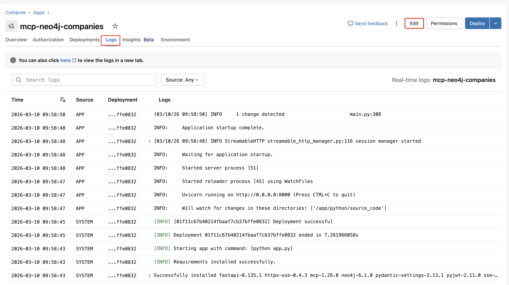
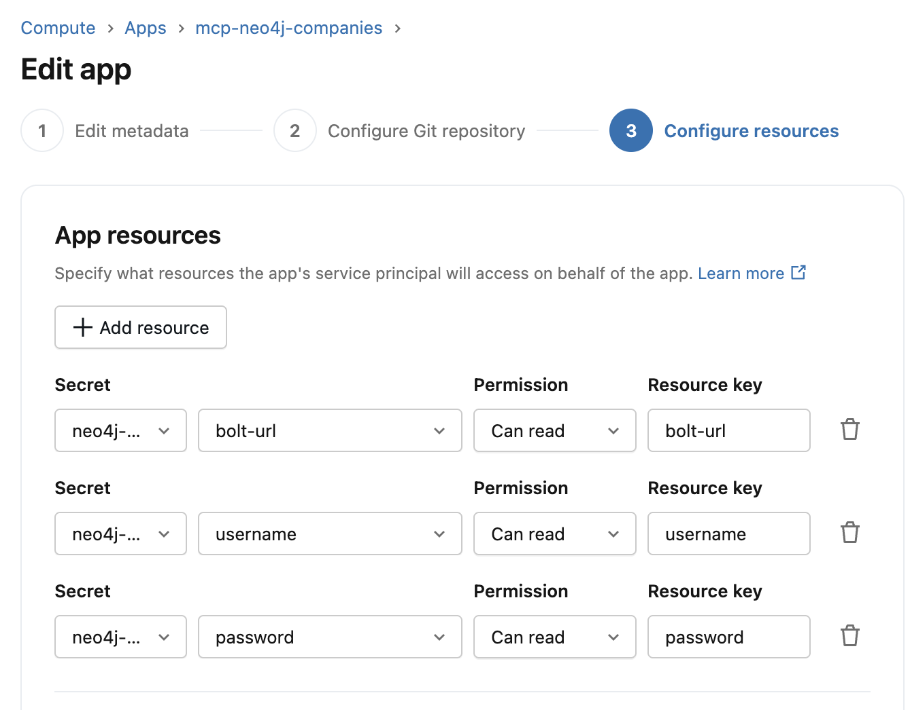
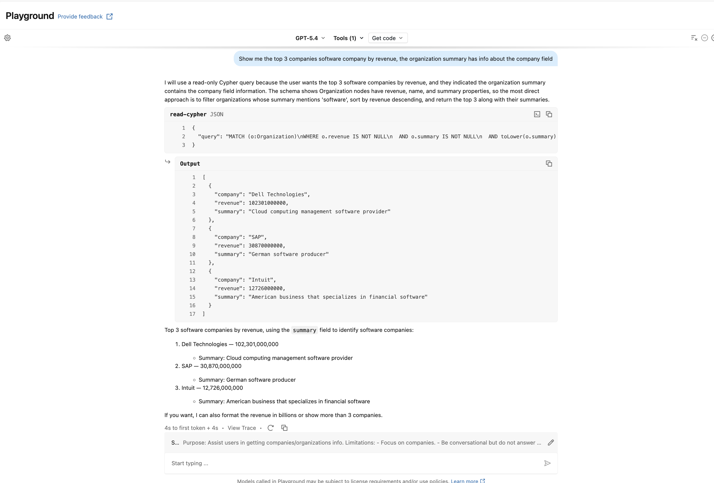

# 1. Databricks Official MCP server (Neo4j via Databricks App)

## Introduction

This guide demonstrates how to deploy the **Official Neo4j MCP Server** using **Databricks Apps**.

This setup allows you to use the official Neo4j **MCP Tools** to interact with a remote Neo4j instance, directly from Databricks apps.  

By following this guide, you can expose Neo4j based MCP Tools and interact with them using the Databricks Agent capabilities, enabling integration with LLM agents or other workflows.

The example shows the full setup to deploy and use the Official Neo4j MCP Server.

---

## Preliminary Notes

This integration pattern fits really well when you need to leverage graph knowledge alongside your Databricks data.
The following example uses the neo4j-mcp-server python package, that encapsulate the official MCP server.

---

## Architecture Overview

-> Databricks Agent / Playground

-> Databricks App defined upon Official MCP Server

-> Proxy to drive requests to the python package

-> Neo4j Database (e.g., demo.neo4jlabs.com / companies dataset)

## Key points:

- The Official Python Neo4j MCP Server exposes the tools to interact with Neo4j.
- A Proxy is the entry point for the Databrikcs App, it controls the requests to the MCP Server.
- The Databricks App is synced with the server.
- The LLM or agent interacts with the MCP Tools.
- The Neo4j connection is secured using SSL.

## Advantages

- No Code & Low infrastructure (Databricks App).
- Fast Prototyping (Local Tests).
- Allows for Complex Scenarios implementation.
- Automatic permission inheritance.
- Credentials hided behind Databricks secrets.
- Schema-level exposure (multiple functions → multiple tools)
- Works in Playground immediately

## Limitations

- Python only.

## Prerequisites

- Databricks Subscription with Compute capabilities.
- Databricks CLI installed on your PC.

## Implementation

### Step 1 - Setup the environment

The first thing to do is to define the Databricks secrets for the Neo4j credentials. It is possible to define an env file and a script to automate the process.

.env
``` 
NEO4J_BOLT_URL=neo4j+s://<your-neo4j>:7687
NEO4J_USERNAME=
NEO4J_PASSWORD=
```

setup_secrets.sh
``` sh
#!/bin/bash

set -e

SCOPE="neo4j-agent"

auth=$(databricks current-user me)
if [[ $auth != *'"active":true'* ]]; then
  echo "❌ Databricks CLI unauthenticated."
  echo ""
  echo "You must login first:"
  echo "databricks auth login --host https://<your-databricks-workspace>"
  echo ""
  exit 1
fi

echo "✅ Databricks CLI authenticated"

# ---- load .env ----
if [ ! -f .env ]; then
  echo "❌ File .env not found. Please create one with the necessary environment variables."
  exit 1
fi

set -o allexport
source .env
set +o allexport

# ---- create scope ----
echo "Creating scope (if not exists)..."
databricks secrets create-scope $SCOPE >/dev/null 2>&1 || echo "Scope already exists, skipping creation."

# ---- upload secrets ----
echo "Uploading secrets..."

databricks secrets put-secret $SCOPE bolt-url \
  --string-value "$NEO4J_BOLT_URL"

databricks secrets put-secret $SCOPE username \
  --string-value "$NEO4J_USERNAME"

databricks secrets put-secret $SCOPE password \
  --string-value "$NEO4J_PASSWORD"

echo "✅ Secrets uploaded successfully"
```

After running the script in the terminal, the secrets will be stored in the Databricks environment.

### Step 2 - Implement the MCP Server

In this guide, the App is kept as simple as possible but you can easly extend it.

#### Project Structure

```
official_neo4j_mcp_server
└───app
   │   app.py
   │   app.yaml
   │   requirements.txt
   |   neo4j_mcp_server_process.py
```

First we define a YAML file that will instruct the Databricks App to bind Databricks Secrets to Environment Variables.

app.env
``` yaml
env:
  - name: NEO4J_URI
    valueFrom: bolt-url

  - name: NEO4J_USER
    valueFrom: username

  - name: NEO4J_PASS
    valueFrom: password
```
Second we define the Python requirements file.

requirements.txt
``` txt
neo4j-mcp-server==1.5.0
uvicorn==0.41.0
fastapi==0.135.1
httpx==0.28.1
```

Third we implement the neo4j_mcp_server_process.py that will simply launch the process and add some control to it.

neo4j_mcp_server_process.py 
``` py
import os
import subprocess
import sys

def neo4j_mcp_server(args: list[str] = []):
    command = ["neo4j-mcp-server"] + args

    print(f"Starting Neo4j MCP Server: {' '.join(command)}", file=sys.stderr)
    print("Neo4j MCP Server listening on http://127.0.0.1:8000", file=sys.stderr)
    print("Press Ctrl+C to stop.", file=sys.stderr)

    try:
        # Execute the process
        process = subprocess.Popen(
            command,
            env=os.environ, 
            stderr=sys.stderr, # Server logs appear in your App logs
            stdout=sys.stdout
        )

        # Keep the script waiting for the process to finish
        # This blocks the script until you press Ctrl+C or the server crashes
        process.wait()

    except KeyboardInterrupt:
        print("\nReceived interrupt signal. Stopping the Neo4j MCP Server...", file=sys.stderr)
        process.terminate()
        try:
            process.wait(timeout=5)
        except subprocess.TimeoutExpired:
            process.kill()
        print("Neo4j MCP Server stopped.", file=sys.stderr)
    except Exception as e:
        print(f"Neo4j MCP Error: {e}", file=sys.stderr)
        sys.exit(1)
```

Finally we implement the entry point of the app that will interact with the Neo4j MCP Server. It consists of a uvicorn app that accept requests and forwards them to the Neo4j MCP process, doing so, it also add the authentication header for the MCP server to properly authenticate the request.

app.py
``` py
import os
import sys
import time
import threading
from fastapi import FastAPI, Request, Response
from fastapi.responses import Response as FastAPIResponse
import httpx
import uvicorn
from neo4j_mcp_server_process import neo4j_mcp_server

try:
    URI = os.getenv("NEO4J_URI") 
    NEO4J_USER = os.getenv("NEO4J_USER") 
    NEO4J_PASS = os.getenv("NEO4J_PASS")
except Exception as e:
    # Fallback for local tests
    # In production on Databricks, this should fail if secrets are missing
    print(f"Warning: Secrets not found ({e}). Check that the application has been configured to access the necessary secrets, that the resource keys are correctly set and that the app.yaml is properly configured to map the resource keys into environment variables.")
    URI = os.getenv("NEO4J_URI", "neo4j://localhost")
    NEO4J_USER = os.getenv("NEO4J_USER", "neo4j")
    NEO4J_PASS = os.getenv("NEO4J_PASS", "password")

TARGET_URL = "http://127.0.0.1:8001"  # neo4j-mcp-server local address
CUSTOM_HEADER_NAME = "Authorization"
NEO4J_USER = os.getenv("NEO4J_USER", "neo4j")
NEO4J_PASS = os.getenv("NEO4J_PASS", "password")
basic_auth = httpx.BasicAuth(NEO4J_USER, NEO4J_PASS)  # Build auth header for the Neo4j server using credentials from environment variables

app = FastAPI()
http_client = httpx.AsyncClient(timeout=60.0)

@app.api_route("/{path:path}", methods=["GET", "POST", "PUT", "DELETE", "PATCH", "OPTIONS", "HEAD"])
async def proxy(request: Request, path: str):
    # Build the target URL by combining the base TARGET_URL with the incoming request path and query parameters
    url = f"{TARGET_URL}/{path}"
    if request.url.query:
        url += f"?{request.url.query}"
    
    # Copy the original headers and add your custom header for authentication to the Neo4j server
    headers = dict(request.headers)
    headers.pop("host", None)  # Remove the Host header to avoid conflicts with the target server
    headers[CUSTOM_HEADER_NAME] = basic_auth._auth_header  # Add the Basic authentication header

    # Read the request body (if any) to forward it to the target server
    body = await request.body()

    try:
        # Forward the request to the Neo4j MCP Server using the httpx client
        resp = await http_client.request(
            method=request.method,
            url=url,
            headers=headers,
            content=body,
            follow_redirects=False
        )

        # Prepare the response headers, excluding certain headers that should not be forwarded back to the client
        excluded_headers = ['content-encoding', 'content-length', 'transfer-encoding', 'connection', 'keep-alive']
        response_headers = {
            name: value for name, value in resp.headers.items() 
            if name.lower() not in excluded_headers
        }
        
        return Response(
            content=resp.content,
            status_code=resp.status_code,
            headers=response_headers
        )
    except httpx.RequestError as exc:
        return Response(
            content=f"Error contacting target server: {str(exc)}",
            status_code=503
        )

def run_neo4j_server():
    """Wrapper function to start the Neo4j server in a separate thread"""
    print("Starting Neo4j MCP Server...", file=sys.stderr)
    try:
        neo4j_mcp_server(args=[
            '--neo4j-uri', os.getenv("NEO4J_URI", URI),
            '--neo4j-database', os.getenv("NEO4J_DATABASE", "companies"),
            '--neo4j-transport-mode', 'http',
            '--neo4j-read-only', 'true',
            '--neo4j-telemetry', 'false',
            '--neo4j-http-host', '0.0.0.0',
            '--neo4j-http-port', '8001',
            '--neo4j-http-allowed-origins', '*'
        ])
    except Exception as e:
        print(f"Critical error in Neo4j server: {e}", file=sys.stderr)
        sys.exit(1)

if __name__ == '__main__':

    # Start the Neo4j server in a separate thread
    t = threading.Thread(target=run_neo4j_server, daemon=True)
    t.start()
    
    # Small delay to ensure the Neo4j server is listening before starting the proxy
    # You might want to implement a retry loop instead of a fixed sleep
    print("Waiting for Neo4j MCP Server to start...", file=sys.stderr)
    time.sleep(3) 

    # 2. Start Uvicorn
    print("Starting FastAPI proxy for Neo4j MCP Server on http://0.0.0.0:8000", file=sys.stderr)
    uvicorn.run(app, host="0.0.0.0", port=8000, log_level="info")
```

We can also test the server locally using a client as follows.

client.py
``` py
from mcp.client.streamable_http import streamable_http_client
from mcp import ClientSession
import asyncio

async def main():
    app_url = "http://localhost:8000/mcp/"
    async with streamable_http_client(app_url) as (
        read_stream,
        write_stream,
        _,
    ):
        async with ClientSession(read_stream, write_stream) as session:
            await session.initialize()
            await session.initialize()
            tools = await session.list_tools()
            print("Tools available:", tools)
            
if __name__ == "__main__":
    asyncio.run(main())
```

### Step 3 - Create the Databricks App

Now we can create the Databricks App that will use our custom Python MCP Server.

Open a terminal in the root of your custom-mcp-server folder and run the command to create the Databricks app.

**It is important that the app name starts with "mcp-", otherwise Databricks will not be able to treat it as an MCP**
```
databricks apps create mcp-<app_name>
```
Then we sync our code with the Databricks app and we deploy/start the app.

```
DATABRICKS_USERNAME=$(databricks current-user me | jq -r .userName)
databricks sync . "/Users/$DATABRICKS_USERNAME/mcp-<app-name>"
databricks apps deploy mcp-<app_name> --source-code-path "/Workspace/Users/$DATABRICKS_USERNAME/mcp-neo4j/"
```

Check your Workspace to review the app name and the synced files.

The App is associated with a Service Principal, be sure that it has the grants to read secrets.

### Step 4 - Pass secrets to the App

Go to Compute -> Apps (Tab)

Check the Logs to ensure that the app is serving correctly and that the Python requirements have been installed, then click on Edit (screenshot)



In the third tab, link your Secrets to unique Resource Keys as follows.



Then scroll down to save the configuration and restart the App.

## Test & Use

### Playground

In the `Playground` select the custom MCP Server from `Tools -> Add Tool -> MCP Servers (Tab)`, add a System Prompt like the following and start asking your first question: `What are the competitors of BigFix?`

```
Purpose: Assist users in getting companies/organizations info.

Limitations:
- Focus on companies.
- Be conversational but do not answer any unrelated queries that are not related to companies.
- Handle queries for multiple companies.
- If there is no company information, do not attempt to retrieve otherwise – inform the user with an appropriate error message.

Data Sources:
- Use the mcp tools you have been provided when requested with questions about companies.

Error Handling:
- Provide clear error messages if Neo4j Connection calls fail.

Sample Questions:
- "What are the competitors of 'BigFix'?"
-"Show me the top 3 companies software company by revenue, the organization summary has info about the company field"
```

The LLM will use the MCP Server to retrieve the information from Neo4j and it will prompt the natural language response.
If the Model states that it cannot use the MCP Server try to switch to another model as Claude Opus 4.6



Note: it is possible to use many Tools coming from different source at the same time (External MCPs, UC Functions, etc...) , giving you the possibility to create more complex agents.

Now that we tested the Agent capabilities, we are ready to use it.

### External use of the Databricks App

From Compute -> Apps you will find the public url associated with your app, alternatively, select your App, in the Status you will find the public url as well.

Now, to integrate the app in your code project, or share it with your team, you need a databricks token and a Client (e.g. Cloude).

```
databricks auth token -p <your-profile>
```

Here an example of a simple Python client with Workspace authentication.

client.py
``` py
from databricks.sdk import WorkspaceClient
from mcp.client.streamable_http import streamable_http_client
from mcp import ClientSession
import asyncio

client = WorkspaceClient()

async def main():
    headers = client.config.authenticate()
    app_url = "https://your.app.url.databricksapps.com/mcp/"
    async with streamable_http_client(app_url,  headers=headers) as (
        read_stream,
        write_stream,
        _,
    ):
        async with ClientSession(read_stream, write_stream) as session:
            await session.initialize()
            tools = await session.list_tools()
            print("Tools available:", tools)  
            
if __name__ == "__main__":
    asyncio.run(main())
```

You can also publish your App into the Databricks Marketplace.


