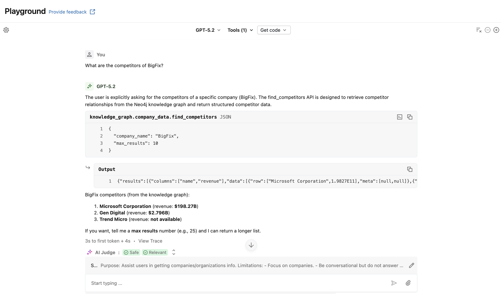
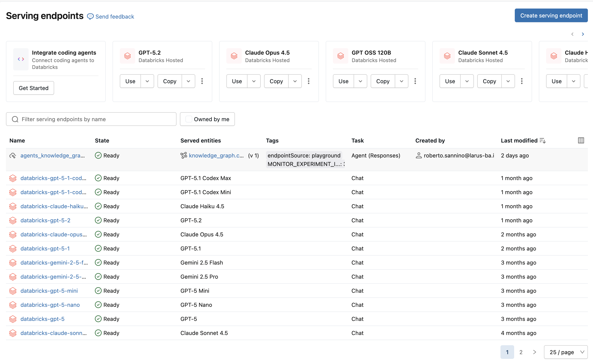
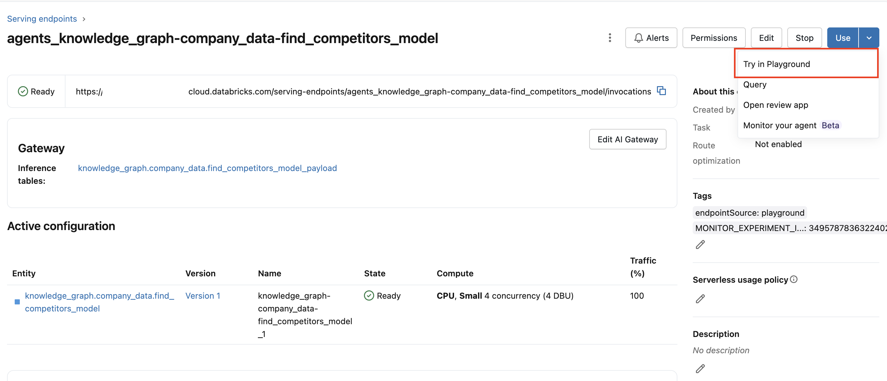

# 1. Databricks Managed MCP server (Neo4j via UC Functions)

## Introduction

This guide demonstrates how to use a **Neo4j database** directly from **Databricks Unity Catalog (UC) Functions**.  

This setup allows you to define **MCP tools** that perform queries on a remote Neo4j instance, directly from Databricks notebooks or agents, in no time and without using a dedicated Neo4j MCP server.  

By following this guide, you can expose Neo4j queries as UC Functions that can be called from Python in Databricks (Tools), enabling integration with LLM agents or other workflows.

The example shows a simple Agent implementation that returns the competitors for a given company name.

---

## Preliminary Notes

This integration pattern **is not intended for production**, but it is the fastest way to prototype your application ideas.

---


## Architecture Overview

-> Databricks Agent / Playground

-> UC Function (Python) as Tools

-> Neo4j REST API

-> Neo4j Database (e.g., demo.neo4jlabs.com / companies dataset)

## Key points:

- UC Functions encapsulate the query logic and handle HTTP calls to Neo4j.
- No MCP server is required; the LLM or agent interacts with UC Functions as Tools.
- The Neo4j connection is secured using basic auth or other credentials.

## Advantages

- Zero infrastructure (Serverless Databricks-managed)
- Fast Prototyping
- Automatic permission inheritance
- Schema-level exposure (multiple functions → multiple tools)
- Works in Playground immediately

## Limitations

- Python/SQL only (no direct Cypher in UC functions)
- Must wrap Neo4j driver calls in functions using HTTP, serverless functions do not give the possibility to use python dependencies outside of a notebook.
- Connection credentials must be hardcoded in the UC Function, secrets are not available inside the UC function - it's an architectural limitation. Unity Catalog functions don't have access to:
  - dbutils (including secrets)
  - Notebook session variables
  - Databricks SDK authentication context

## Prerequisites

- Databricks Subscription with Compute capabilities.
- Create a Databricks Token from your personal area, under Developer -> Access Tokens.

## Implementation

### Step 1 - Create one or more UC Functions

Create a new `Notebook` in your `Workspace` and define the following cells, here we are defining a UC function to retrieve the competitors of a given company, this funciton will act as a tool for the LLM.

```
%sql
/* Create the catalog and schema where the UC function will be available */
CREATE CATALOG IF NOT EXISTS knowledge_graph;
CREATE SCHEMA IF NOT EXISTS company_data;
CREATE SCHEMA IF NOT EXISTS knowledge_graph.company_data;
```

```
%sql
/* Define the UC function and implements its behavior, in this example, the function finds the competitors of a given company by performing a cypher query through HTTP */
CREATE OR REPLACE FUNCTION knowledge_graph.company_data.find_competitors(
  company_name STRING,
  max_results INT
)
RETURNS STRING
COMMENT 'Finds competitors using Neo4j graph traversal and returns structured competitor data'
LANGUAGE PYTHON
AS $$

import requests
import base64
import json

url = "https://demo.neo4jlabs.com:7473/db/companies/tx/commit"
# Databricks secrets (dbutils.secrets) are not available outside of the notebook, therefore, they cannot be used in a serverless UC Function
auth = base64.b64encode(b"companies:companies").decode()

headers = {
  "Authorization": f"Basic {auth}",
  "Content-Type": "application/json",
  "Accept": "application/json"
}

cypher_query = f"""
MATCH (c:Organization {{name: '{company_name}'}})-[:HAS_COMPETITOR]->(competitor:Organization)
RETURN competitor.name as name, competitor.revenue as revenue
LIMIT {max_results}
"""

payload = {
    "statements": [
        { "statement": cypher_query }
    ]
}

r = requests.post(url, json=payload, headers=headers)
r.raise_for_status()

return r.text

$$;
```

```
%sql
/* Test the function */
SELECT knowledge_graph.company_data.find_competitors(
  'BigFix',
  5
);
```

Once the Notebook cells are ran and the test works as expected, the UC function will be listed in the `Catalog`, now we are ready to use it as a tool for our Agent.

### Step 2 - Playground Test & Deploy

In the `Playground` select our new UC function from `Tools -> Add Tool`, add a System Prompt like the following and start asking your first question: `What are the competitors of BigFix?`

```
Purpose: Assist users in getting companies/organizations info.

Limitations:
- Focus on companies.
- Be conversational but do not answer any unrelated queries that are not related to companies.
- Handle queries for multiple companies.
- If there is no company information, do not attempt to retrieve otherwise – inform the user with an appropriate error message.

Parameters:
- Company name
- Max results

Data Sources:
- Use the find_competitors API tool when requested with questions about company's competitors.

Actions:
1. Retrieve company info
2. Retrieve competitors

Error Handling:
- Provide clear error messages if Neo4j Connection calls fail.

Sample Questions:
- "What are the competitors of 'BigFix'?"
```

The LLM will use the UC function to retrieve the information from Neo4J and it will prompt the natural language response.



Note: it is possible to use many Tools at the same time, giving the possibility to create more complex agents.

Now that we tested the Agent capabilities, we are ready to deploy it.

From the `Get Code` button, click on `Create Agent Notebook`, then, follow the steps (replace all the TODOs).

By running all the cells, the model will be available under the `Serving` tab.



Finally it will be possible to click on `Try in Playground` to test it for the last time.



Once the test is over, click on the `Get Code` button to access the `Curl` and `Python APIs` (a Databricks Token must be set to use the APIs).
Going on it will be possible to use the Agent using the provided APIs!

Curl API example:
```
curl https://dbc-...cloud.databricks.com/serving-endpoints/agents_knowledge_graph-company_data-find_competitors_model/invocations \
  -X POST \
  -H "Authorization: Bearer $DATABRICKS_TOKEN" \
  -H "Content-Type: application/json" \
  -d '{"input":[{"role":"user","content":"What is an LLM agent?"}],"databricks_options":{"conversation_id":"...","return_trace":true},"context":{"conversation_id":"...","user_id":"..."}}'
```