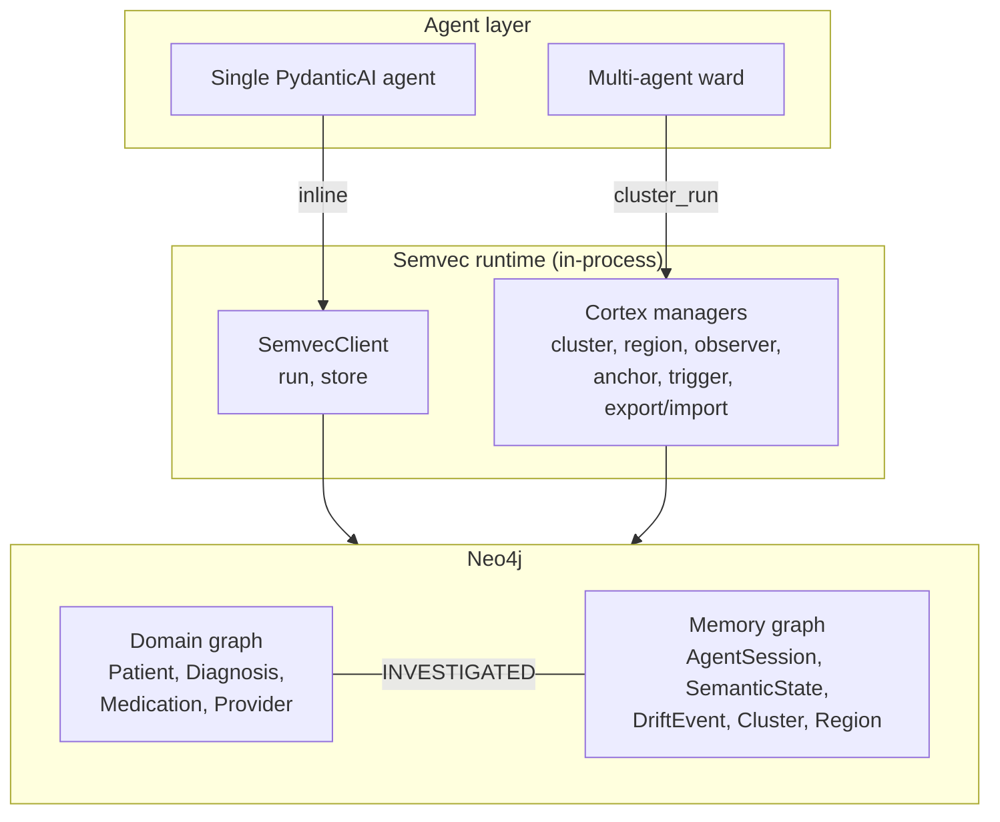
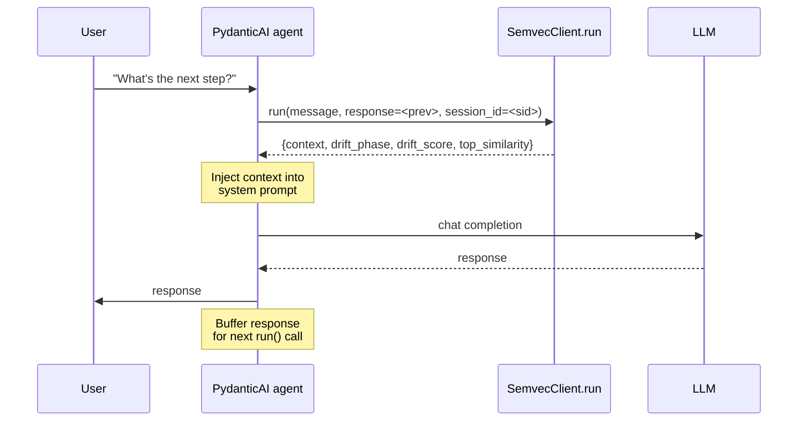
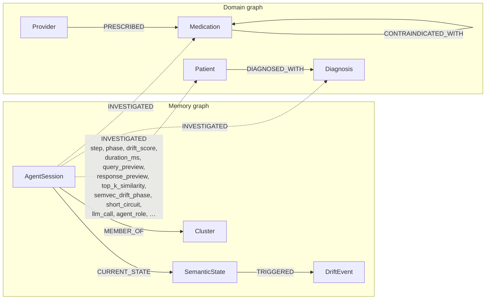

# Building Multi-Agent Systems with Persistent Semantic Memory: Semvec, Semvec Cortex, and Neo4j

A clinical assistant that remembers a patient's full history across a 12-hour shift handover — and that knows which colleague already investigated the same case three hours earlier — is fundamentally different from one that treats every conversation as a fresh start. LLMs don't have native memory; they fake it by re-reading the entire conversation each turn. Token costs grow linearly. Context windows snap. And the moment a second agent enters the picture, even that illusion breaks down.

This post walks through how **[Semvec](https://pypi.org/project/semvec/)** gives a single agent persistent semantic memory in roughly three lines of Python, and how **Semvec Cortex** (the same library's multi-agent layer) scales that memory engine across teams of agents — with **Neo4j** as the single source of truth for both the domain and the conversational state. We'll build a healthcare assistant that starts as one PydanticAI agent and grows into a multi-department network with shared memory, drift consensus, and cross-shift handover.

All code in this post comes from two open repositories you can run locally:

- **[`johnymontana/habitat-ai-test`](https://github.com/johnymontana/habitat-ai-test)** — single-instance Semvec with PydanticAI
- **[`MichaelNeuberger/neo4j-agent-integrations`](https://github.com/MichaelNeuberger/neo4j-agent-integrations)** — Semvec Cortex reference implementation on Neo4j

> The runtime now ships as the [`semvec`](https://pypi.org/project/semvec/) Python package. Earlier versions of this stack used a hosted REST API; that dependency is gone. There is no API key, no base URL, no network round-trip. Everything runs in your process.

> **About `SemvecClient`.** Every code snippet below uses a class called `SemvecClient`. That class is **not** part of `pip install semvec` — it is a thin in-process façade defined in this repo at [`semvec-drift-detection/src/core/semvec_client.py`](https://github.com/MichaelNeuberger/neo4j-agent-integrations/blob/main/semvec-drift-detection/src/core/semvec_client.py). It composes `SessionManager`, `ClusterManager`, `RegionalManager`, `GlobalObserver`, and `NetworkManager` from `semvec.api.*` into one ergonomic surface that returns plain dicts. The PyPI package itself exports the underlying primitives (`SemvecState`, `SemvecConfig`, `MultiResolutionMemory`, `PhaseDetector`, `LiteralCache`, `ResonanceTrigger`, plus the exception hierarchy) — cloning the integrations repo is required for the client surface, the demo scenarios, and the persistence stores. A reader who runs `from semvec import SemvecClient` will get an `ImportError`; the symbol lives only in this repo.

---

## The memory illusion

Every LLM API call is stateless. To make a model "remember" what was said three turns ago, the application replays the full conversation. A 100-turn conversation pays for the first user message 100 times. By turn 200, you're either truncating context (the model forgets the early decisions) or hitting a hard window limit (the request fails outright).

Retrieval-augmented generation softens this by chunking and re-injecting only the relevant pieces, but RAG alone still has three weaknesses for long-running agents:

1. **No notion of conversational phase.** A retrieval index doesn't know whether the agent is exploring or converging.
2. **No drift detection.** When the agent's topic silently shifts (a clinician switches from cardiology to administrative questions), nothing flags it.
3. **No sharing across agents.** Each session has its own index; a colleague starting a new session sees none of it.

Semvec was built to solve (1) and (2) for a single agent. Its multi-agent layer (Semvec Cortex) extends it to (3). Both are model-agnostic and persist their structured output to Neo4j.

The numbers are worth showing up front. On the standard long-conversation benchmarks, the compression is significant *while quality holds or improves*:

| Benchmark              | Token savings | Quality (relevance Δ) |
|------------------------|---------------|------------------------|
| MT-Bench (160 turns)   | **97.4 %**    | +0.06                  |
| MT-Eval (395 turns)    | **99.0 %**    | +0.64                  |
| LongBench V2 (503 turns) | **98.8 %**  | +0.47                  |

Those savings are what make multi-agent scenarios economically interesting in the first place — a ward of ten specialists making 50 queries each per shift is no longer prohibitive.

---

## Architecture overview

The full stack across both repos:



Two design choices are worth calling out before we look at code.

**Domain knowledge and conversational state coexist in the same Neo4j graph.** Patients, medications, providers, and diagnoses live alongside agent sessions, drift events, and cluster memberships. A single Cypher query can join "what does the agent know" with "what was asked, when, and by whom." That bridge — the `INVESTIGATED` relationship — is the architectural payoff.

**Semvec does the hard math; Neo4j stores the result.** Embedding generation, drift scoring, cluster aggregation, and observer sampling all happen inside the in-process Semvec runtime. The Neo4j integration is intentionally thin: a set of stores that persist sessions, states, drift events, and cluster relationships as the runtime returns them. There's no duplicated logic.

---

## Part one — Single-agent memory with Semvec

Let's start with the smallest useful agent: a PydanticAI assistant with persistent memory across sessions.

### The inline pattern

Semvec's `run` method does two things in one call: it stores the previous turn's Q&A pair (when you pass `response=`), and it returns the compressed semantic context for the *current* user message. The compression is a semantically-ranked subset of past memories, not the raw chat history.



A minimal client looks like this:

```python
from dataclasses import dataclass, field
from src.core.embedder import SentenceTransformerEmbedder
from src.core.semvec_client import SemvecClient


@dataclass
class MemoryClient:
    semvec: SemvecClient = field(
        default_factory=lambda: SemvecClient(embedder=SentenceTransformerEmbedder())
    )
    session_id: str | None = None
    _prev_response: str | None = field(default=None, repr=False)

    def run(self, message: str) -> str:
        """Return compressed context; inline-store the previous Q&A pair."""
        result = self.semvec.run(
            message=message,
            session_id=self.session_id,
            response=self._prev_response,  # store previous turn alongside this run
        )
        self.session_id = result["session_id"]   # captured on first turn
        self._prev_response = None
        return result.get("context", "")

    def set_prev_response(self, answer: str) -> None:
        self._prev_response = answer
```

Two details matter. First, the `session_id` is allocated by Semvec on the first call and reused thereafter — that's how the same agent picks up where it left off across process restarts. Second, the *previous* LLM response is buffered and sent with the *next* `run()` call. The store-and-retrieve happen together, so there's no race window where an answer is given but not yet remembered.

### PydanticAI integration

The Semvec context becomes part of the agent's system prompt. PydanticAI exposes this cleanly via the `@agent.system_prompt` decorator:

```python
agent = Agent(
    MODEL,
    deps_type=Deps,
    instructions=(
        "You are a helpful assistant. Answer the user's question using "
        "the conversation context provided below when relevant."
    ),
)


@agent.system_prompt
async def inject_semvec_context(ctx: RunContext[Deps]) -> str:
    # The context block is rebuilt each turn from Semvec — only the
    # memories the engine deems relevant to the current user message.
    if ctx.deps.semvec_context:
        return f"Memory context from previous conversations:\n{ctx.deps.semvec_context}"
    return ""
```

The main loop then becomes:

```python
async def chat_turn(memory: MemoryClient, user_input: str) -> str:
    # 1. Ask Semvec for context (and store the prior turn).
    context = memory.run(user_input)

    # 2. Run the LLM with the freshly assembled system prompt.
    deps = Deps(memory=memory, semvec_context=context)
    result = await agent.run(user_input, deps=deps)

    # 3. Buffer the response so the next run() call persists it.
    memory.set_prev_response(result.output)
    return result.output
```

### What you get for free

Each Semvec response includes more than just compressed text. The result dict carries the conversational `drift_phase`, the current `drift_score`, the `top_similarity` against existing memories, and a `short_circuit` flag (true when a paraphrase of an earlier question is recognised and the LLM call can be skipped):

```
[Semvec Context | Turn 12 | 18 memories]
Relevant context:
  1. [0.85] Q: What's the hosting budget? A: ECS Fargate, 600 EUR/month
  2. [0.61] Q: What OCR tech? A: AWS Textract for German and English invoices
```

The phase progresses through `stable → shifting → drifted` as the agent's semantic state diverges from the accumulated context. A jump back to `shifting` or `drifted` is a leading indicator that the topic has shifted — useful if you want to alert a human, switch tools, or branch to a different agent.

In ~200 lines of PydanticAI plus three lines of Semvec, you have an agent with unlimited session length and constant token cost per turn. The session is queryable in Neo4j as a chain of `SemanticState` nodes, with a `CURRENT_STATE` pointer:

```cypher
MATCH (s:AgentSession {session_id: $sid})-[:CURRENT_STATE]->(state:SemanticState)
MATCH (state)-[:PREVIOUS*0..]->(prev:SemanticState)
RETURN prev.timestamp, prev.phase, prev.beta
ORDER BY prev.timestamp;
```

### Live token savings

The ~97% compression number from the headline table is not a once-and-for-all benchmark — every turn carries its own measurement. `SemvecChatProxy` (under `semvec.token_reduction`) wraps an OpenAI-shaped `llm_call` callable and returns the **PSS-compressed prompt token count next to what the same conversation would have cost** if you replayed the full history each turn. The wrapper exposes it via :py:meth:`SemvecClient.create_chat_proxy`:

```python
from src.core.semvec_client import SemvecClient

semvec = SemvecClient(...)
proxy = semvec.create_chat_proxy(
    llm_call=my_llm,        # any callable returning a str; expose .last_usage to get exact counts
    system_prompt="You are a clinical assistant.",
)

for question in clinic_questions:
    turn = proxy.turn(question)
    print(turn["pss_input_tokens"], "vs", turn["baseline_input_tokens"], "phase", turn["phase"])

print(proxy.summary())   # {total_turns, total_pss_tokens, total_baseline_tokens, savings_pct, per_turn:[...]}
```

Scenario 1 of the demo prints both per-turn and cumulative token counts as you type — the compression ratio rises with conversation depth, exactly as the benchmark numbers predict, and it does so against your own questions and your own LLM, not a curated dataset.

But this agent is alone.

---

## Where single-instance memory ends

Single-agent Semvec covers a lot of ground. It breaks down at exactly three points:

- **Three specialists at the same patient.** A pulmonologist starts a session about David Park's COPD. An hour later, a cardiologist starts her own session about the same patient's hypertension. Neither knows what the other already established. They duplicate work, contradict each other, and burn LLM calls on questions someone else already answered.
- **Two hospitals drift simultaneously.** Cardiology at Memorial General drifts from clinical to administrative questions. Forty minutes later, Emergency at Riverside Medical does the same. Neither sees the other's drift, so no one notices the systemic signal.
- **Shift change at 6 a.m.** The night-shift physician hands over to the day-shift physician with a written note. The semantic context — the things she *almost* asked, the trajectory of her reasoning — is lost.

Each of these requires the same memory engine to reach beyond a single session. That's what Semvec Cortex does.

---

## Part two — Multi-agent memory with Semvec Cortex

Cortex methods sit on the same `SemvecClient`. Same client, same instance, additional methods that orchestrate session, cluster, region, observer, and network managers from the bundled `semvec` package.

```python
from src.core.embedder import SentenceTransformerEmbedder
from src.core.semvec_client import SemvecClient

# One client wires up sessions, clusters, regions, observer, and network.
semvec = SemvecClient(embedder=SentenceTransformerEmbedder())
```

### Layer 1b — Anchors, triggers, and synthetic memory injection

When an agent has a fixed domain (oncology pharmacist, payments compliance officer), you can pin the session to that domain with an *anchor*: a target embedding the session is supposed to stay near. Semvec then exposes an `anchor_score` showing how far the conversation has drifted from that target, and an `isolation` mode that quarantines off-topic queries.

You can also inject *synthetic memories* — facts the agent should "remember" without ever having been told. This is where the Neo4j domain graph starts to feed back into the agent. Concretely, for an oncology pharmacist monitoring chemotherapy patients, we pull every contraindication from the graph and inject it directly into the session's long-term memory tier:

```python
# Pull contraindications from the Neo4j domain graph.
contraindications = neo4j.run("""
    MATCH (m1:Medication)-[:CONTRAINDICATED_WITH]->(m2:Medication)
    RETURN m1.name AS drug_a, m2.name AS drug_b, m1.severity AS severity
""").data()

session_id = semvec.create_session()["session_id"]

# Inject each one as a long-term memory in the agent's Semvec session.
embedder = SentenceTransformerEmbedder()
for c in contraindications:
    text = f"CRITICAL: {c['drug_a']} and {c['drug_b']} are contraindicated."
    embedding = embedder.get_embedding(text).astype(float).tolist()
    semvec.inject_memory(
        session_id=session_id,
        embedding=embedding,
        text=text,
        tier="long_term",
        importance=1.0,
    )

# Add a resonance trigger so any mention of "contraindication" boosts recall.
semvec.add_trigger(session_id, keyword="contraindication")

# Lock the session to oncology — drift beyond this anchor will be flagged.
anchor_emb = embedder.get_embedding("oncology chemotherapy treatment").astype(float).tolist()
semvec.add_anchor(session_id, anchor_emb)
semvec.set_isolation(session_id, level="QUARANTINE", similarity_threshold=0.55)
```

The agent never asked about contraindications, and the LLM was never trained on this hospital's formulary — but the moment a clinician asks about a new prescription, the relevant memory surfaces because Semvec recognizes the semantic neighborhood.

### Verbatim facts: dates, amounts, identifiers

Semantic memory is great for *meaning* — it is dangerous for *exact values*. Compress "the next infusion is on 2026-05-15" into an embedding and a clinician later asking "when is the next infusion?" might get back "next month" or, worse, the wrong date. `semvec.compliance.extractors` solves this by pulling regex-recognised facts (ISO/DE/US dates, EUR/USD/kg/% numerics, UUID/IBAN/DE-VAT identifiers) out of free-form text **before** the input is folded into the EMA vector. Each fact lands in the literal cache where it survives compression byte-for-byte.

Two thin wrappers expose the path on `SemvecClient`:

```python
text = "Carlos starts therapy on 2026-05-15. Reimbursement IBAN DE89 3704 0044 0532 0130 00."

facts = semvec.extract_facts(text)
# [{"kind": "date", "raw": "2026-05-15", "value": "2026-05-15T00:00:00+00:00", ...},
#  {"kind": "identifier", "raw": "DE89 3704 0044 0532 0130 00",
#   "value": "DE89370400440532013000", "id_type": "iban", ...}]

semvec.store_facts_as_entities(session_id, text)
# {"stored": 2}  — entries land in the session's literal cache
```

Two caveats worth calling out: the upstream unit whitelist is small (built for finance/operations), so medical units like `mg/m²` are not auto-detected — for those, prefer `inject_memory` with the full sentence. And the literal cache stores facts under the kind `constant` because the upstream `EntityKind` enum is closed; the original fact kind (`numeric` / `date` / `identifier`) is preserved in the entity context for downstream filtering.

### Layer 2 — Clusters: shared memory across agents

A cluster is a shared semantic state that multiple agent sessions read from and write to. When agent A stores a Q&A pair into the cluster, agent B's next query gets the answer back as a context HIT — and the LLM call is short-circuited entirely.

Three specialists examining David Park (essential hypertension, COPD):

```python
# Dr. Chen (internist) creates the shared cluster and seeds it.
cluster = semvec.create_cluster(
    name="ward_round_david_park",
    aggregation_mode="weighted_average",  # newer evidence weighted higher
)
cid = cluster["cluster_id"]
semvec.add_cluster_member(cid, chen_session)

for question, answer in chens_baseline_qa_pairs:
    semvec.cluster_store(cid, message=question, response=answer)

# Dr. Volkov (pulmonologist) joins the cluster and asks her own question.
semvec.add_cluster_member(cid, volkov_session)
result = semvec.cluster_run(
    cluster_id=cid,
    message="What's the patient's current oxygen saturation trend?",
    short_circuit_threshold=0.85,  # cached answer >0.85 → skip LLM
)

if result["short_circuit"]:
    # Chen already answered something semantically equivalent.
    answer = result["context"]
else:
    # Novel question — call the LLM, then store back into the cluster.
    answer = llm.respond(result["context"], message)
    semvec.cluster_store(cid, message=question, response=answer)
```

The Neo4j side stores the cluster membership and the `INVESTIGATED` edges from each agent to the entities they touched. A single query then answers "who has looked at David Park, and what did each one find?":

```cypher
MATCH (cluster:Cluster {cluster_id: $cid})<-[:MEMBER_OF]-(s:AgentSession)
MATCH (s)-[inv:INVESTIGATED]->(e)
RETURN s.agent_id, labels(e)[0] AS entity_type, e.name,
       inv.step, inv.drift_score, inv.duration_ms, inv.short_circuit
ORDER BY s.agent_id, inv.step;
```

### Layer 3 — Regions: consensus drift across clusters

A region groups multiple clusters and watches for *correlated* drift events. If both the cardiology cluster at Memorial General and the emergency cluster at Riverside Medical drift toward the same off-domain topic within a configurable time window, the region emits a consensus drift event.

```python
region = semvec.create_region(
    name="hospital_network_north",
    consensus_threshold=0.5,         # half the clusters must drift
    vote_window_seconds=60.0,
)
rid = region["region_id"]
semvec.add_region_cluster(rid, cardiology_cluster_id)
semvec.add_region_cluster(rid, emergency_cluster_id)

# Later — the region exposes the events the system noticed:
events = semvec.get_region_events(rid, limit=20)
for e in events:
    print(e["timestamp"], e["drift_score"], e["drift_phase"], e["cluster_id"])
```

What this catches in practice: a hospital network IT outage shows up as multiple clusters simultaneously drifting from clinical to "I can't access the chart" queries — long before any single ticket reaches the help desk.

### Layer 4 — Global Observer: cross-region anomaly sampling

The observer sits one level above regions. It samples periodically (or on demand), looking for anomalies that no individual region would flag — a cluster that's been silent for too long, a region whose consensus events are accelerating, an unusual coupling between two regions.

```python
semvec.create_observer(
    sample_interval_seconds=30.0,
    region_ids=[north_region_id, south_region_id],
)

# Force a sample now and inspect:
semvec.observer_sample()
anomalies = semvec.get_anomalies(limit=20)
for a in anomalies:
    print(a["severity"], a["anomaly_type"], a["affected_cluster_ids"], a["description"])
```

In Neo4j, anomalies can be persisted as `AnomalyEvent` nodes connected to the regions and clusters they reference, queryable alongside everything else.

### Layer 5 — Export, import, and network transfer: the shift handover

The night-shift physician's session has built up six turns of deep context about a difficult patient. At 6 a.m. she exports it (with a SHA-256 checksum), and the day-shift physician imports it. His first query immediately surfaces the relevant memories — `top_similarity = 0.578` instead of the `0.000` he'd see starting cold.

```python
# Night shift — export at end of session.
exported = semvec.export_session(volkov_session_id)
# exported["state_dict"] is a dict; exported["checksum"] is SHA-256.

# Day shift — import on a fresh session for the new physician.
tanaka_session_id = semvec.create_session()["session_id"]
semvec.import_session(tanaka_session_id, state_dict=exported["state_dict"])

# Optional: a partial semantic delta transfer instead of a full import,
# capped at max_weight to avoid swamping the receiver's existing context.
semvec.transfer_delta(
    source_session_id=volkov_session_id,
    target_session_id=tanaka_session_id,
    max_weight=0.15,
)
```

The Neo4j graph then shows both physicians as having `INVESTIGATED` the same patient, with `imported_from` and `baseline_delta` properties marking the handover boundary.

---

## The bridge: INVESTIGATED in Neo4j

This is the relationship that makes the whole architecture pay off. Every time an agent touches a domain entity — a patient, a medication, a diagnosis — an `INVESTIGATED` edge is written, carrying a rich audit-trail payload.



Every edge carries:

| Property                 | What it records                                             |
|--------------------------|-------------------------------------------------------------|
| `step`                   | Turn number inside the session                              |
| `phase`                  | Demo phase marker (`on-topic`, `chen-baseline`, `tanaka-ecg`, `memory-injection`, `phase-4-cache`, …) |
| `drift_score`            | Drift score at this turn (0.0–1.0)                          |
| `started_at`, `ended_at` | ISO-8601 UTC timestamps wrapping the turn                   |
| `duration_ms`            | Wall-clock duration including the LLM call                  |
| `query_preview`          | First 200 chars of the user message                         |
| `response_preview`       | First 240 chars of the LLM answer                           |
| `top_k_similarity`       | Cosine similarity to the rolling top-K of recent embeddings |
| `semvec_drift_phase`     | Semvec's own phase: `stable` / `shifting` / `drifted`       |
| `short_circuit`          | True iff the LLM was skipped (paraphrase HIT)               |
| `llm_call`               | Inverse of `short_circuit` — useful for cost dashboards     |
| `agent_role`             | The role string seen by the LLM (`"a cardiologist…"`)       |
| Per-scenario extras      | `cluster_id`, `shift`, `imported_from`, `baseline_delta`, `paraphrase_of`, `trigger_keyword`, `memory_text`, … |

A single Cypher query joins both sides. *"Which agents investigated James Morrison, in which cluster, did any of them drift, and what diagnoses did they end up touching?"*

```cypher
MATCH (s:AgentSession)-[inv:INVESTIGATED]->(pat:Patient {name: 'James Morrison'})
MATCH (pat)-[:DIAGNOSED_WITH]->(diag:Diagnosis)
OPTIONAL MATCH (s)-[:CURRENT_STATE]->(:SemanticState)-[:TRIGGERED]->(d:DriftEvent)
OPTIONAL MATCH (s)-[:MEMBER_OF]->(c:Cluster)
RETURN s.agent_id,
       inv.step,
       inv.drift_score,
       inv.duration_ms,
       inv.semvec_drift_phase,
       diag.name AS diagnosis,
       d.severity AS drift_severity,
       c.name AS cluster
ORDER BY s.agent_id, inv.step;
```

Pure conversational memory cannot answer this — it doesn't know what a diagnosis is. Pure domain graphs cannot answer this — they don't know about drift. The bridge is what makes the question askable in the first place.

A second query, the kind a compliance reviewer wants: *"Show every short-circuited turn in the last week — which questions were answered from cache and against which patients?"*

```cypher
MATCH (s:AgentSession)-[inv:INVESTIGATED]->(pat:Patient)
WHERE inv.short_circuit = true
  AND inv.started_at >= datetime() - duration('P7D')
RETURN s.agent_id, pat.name,
       inv.query_preview, inv.paraphrase_of,
       inv.top_k_similarity, inv.duration_ms
ORDER BY inv.started_at DESC;
```

A third — the shift-handover audit trail: *"For each handover, did Tanaka's first day-shift query benefit from Volkov's imported state?"*

```cypher
MATCH (s:AgentSession)-[inv:INVESTIGATED]->(pat:Patient)
WHERE inv.imported_from IS NOT NULL
RETURN s.agent_id, pat.name,
       inv.imported_from AS source_session,
       inv.baseline_delta AS sim_uplift,
       inv.query_preview
ORDER BY inv.started_at DESC;
```

The schema that makes this possible is small. The full file is `semvec-drift-detection/schema/semvec_schema.cypher`; the relevant pieces:

```cypher
CREATE CONSTRAINT agent_session_unique IF NOT EXISTS
  FOR (s:AgentSession) REQUIRE s.session_id IS UNIQUE;

CREATE CONSTRAINT semantic_state_unique IF NOT EXISTS
  FOR (s:SemanticState) REQUIRE s.state_id IS UNIQUE;

CREATE VECTOR INDEX semantic_state_vector IF NOT EXISTS
  FOR (s:SemanticState) ON (s.vector)
  OPTIONS {indexConfig: {
    `vector.dimensions`: 768,
    `vector.similarity_function`: 'cosine'
  }};

CREATE INDEX drift_severity_time IF NOT EXISTS
  FOR (d:DriftEvent) ON (d.severity, d.timestamp);
```

The `768` matches the default embedder (`all-mpnet-base-v2`); switch back to `all-MiniLM-L6-v2` and you'd want `384`. Pick the dimension once — every session and every persisted state vector must agree.

A vector index on `SemanticState.vector` means you can also do approximate-nearest-neighbor queries directly against historical agent state — useful when you want to ask "have we ever been in a similar conversational state before?" across the full audit log, not just within an active session.

---

## Drift detection in practice

The healthcare demo runs four phases through one agent: 17 turns of diabetes (James Morrison), 5 turns of psychiatry (Aisha Patel), 3 turns of cardiology (Maria Rodriguez), and 5 paraphrased Phase-1 queries. The expectation is that DRIFT fires only at the genuine specialty switches — Phase 1 → 2 and Phase 2 → 3 — not within-specialty topic drift.

A pure threshold on Semvec's `drift_score` doesn't separate cleanly: medical sub-topics (Lisinopril versus Atorvastatin versus catheterization) produce drift scores in the same band as a real specialty switch. What works in practice is a **combined** rule:

```python
def is_drift(result: dict) -> bool:
    """Flag DRIFT only when score is high AND similarity is low."""
    if result.get("drift_detected", False):
        return True   # Semvec's own verdict (drift_score >= 0.5)
    return (
        result["drift_score"] >= 0.35
        and result["top_similarity"] <= 0.45
    )
```

The intuition: a high `drift_score` paired with a still-high `top_similarity` means the new query is semantically novel but the accumulated context already covers it (a sub-topic, not a new domain). A high `drift_score` paired with a low `top_similarity` means the query is novel *and* unrelated to anything in memory — a real topic switch.

We also tested a top-K rolling-window detector inspired by the BMW reference implementation. It worked beautifully on automotive data but produced five false positives in healthcare Phase 1 (medical sub-topics are too varied). The kept signal goes onto every INVESTIGATED edge as `top_k_similarity` for downstream analysis, but the verdict comes from the Semvec-side combination above.

---

## When the region needs an explicit vote: ConsensusEngine

Region-level drift detection (Layer 3) flags *correlated* drift on its own — but sometimes the application wants a deliberate, named voting protocol on top of that signal. `semvec.cortex.ConsensusEngine` gives every consensus mode a first-class API: `SIMPLE_MAJORITY`, `QUALIFIED_MAJORITY`, `UNANIMOUS`, `WEIGHTED_VOTE`, `ADAPTIVE_THRESHOLD`. The wrapper threads it through:

```python
eng = semvec.create_consensus_engine(
    local_id="hospital-orchestrator",
    network_id="hospital-network",
    level="qualified_majority",
)
for inst, weight in [("cardio", 1.0), ("emerg", 1.0), ("supervisor", 1.5)]:
    semvec.register_consensus_voter(eng["engine_id"], inst, weight=weight)

prop = semvec.submit_consensus_proposal(
    eng["engine_id"],
    proposal_type="admin_pivot_alert",
    proposed_state=[0.0] * 8,
    rationale="Both clusters drifted to facility-admin within the vote window — incident?",
)
semvec.vote_on_consensus(eng["engine_id"], prop["proposal_id"], True,  voting_instance="cardio")
semvec.vote_on_consensus(eng["engine_id"], prop["proposal_id"], False, voting_instance="emerg")
semvec.vote_on_consensus(eng["engine_id"], prop["proposal_id"], True,  voting_instance="supervisor")

verdict = semvec.evaluate_consensus(eng["engine_id"], prop["proposal_id"])
# {"accepted": True, "ratio": 0.71, "votes_for": 2, "votes_against": 1, "status": "accepted"}
```

Scenario 5 of the demo wires this directly behind the existing region-drift step: when both hospital clusters drift to admin topics, a qualified-majority vote decides whether to escalate to a network-wide incident.

---

## Behavioural-consistency probe after import

Layer 5's checksum (`exported["checksum"]`) catches *bit-level* corruption on transfer — useful, but it cannot tell you whether the imported state actually behaves like the source. `verify_consistency` runs an embedding probe through both sessions and checks whether the cosine similarities match within a configurable tolerance:

```python
exp = semvec.export_session(volkov_session_id)
semvec.import_session(tanaka_session_id, exp["state_dict"])

# Probe with a few representative healthcare queries
emb = SentenceTransformerEmbedder()
probes = [emb.get_embedding(t).astype(float).tolist() for t in (
    "Morrison overnight glucose trend",
    "Metformin held for catheterization",
    "Cardiac biomarkers at 6h",
)]

passed = semvec.verify_consistency(
    tanaka_session_id, probes,
    reference_session_id=volkov_session_id,
    tolerance=1e-3,
)
print("consistency probe:", "passed" if passed else "FAILED")
```

The demo's Scenario 6 prints `consistency probe: PASSED / FAILED` directly under the import line, so a corrupted handover is visible at hand-off time, not three turns later when the wrong recommendation surfaces.

---

## Production patterns

A few things we've learned applying Semvec and Cortex in real deployments:

**Pick one embedder, stick with it.** The default is `all-mpnet-base-v2` (768-d) — better recall than the older `all-MiniLM-L6-v2` (384-d). The vector index dimension in Neo4j must match; switching mid-deployment requires re-embedding every persisted `SemanticState`.

**Cluster lifecycle is short-lived by default.** A cluster maps to a unit of shared work — a ward round, an incident response, a sales call team. Create it when the work starts, delete it when it ends. Long-lived clusters drift; shared memory from three months ago usually hurts more than it helps. If you genuinely need long-term shared knowledge, promote it explicitly into the domain graph instead.

**`consensus_threshold` is your false-positive dial.** Set it too low (e.g. 0.2) and you'll get region events for any random correlation. Set it too high (e.g. 0.9) and you'll never see anything until it's already a major incident. Start at 0.5 with `vote_window_seconds=60`, then tune from observed event rates. When you need a *named* protocol on top of that signal — for example "any escalation needs a qualified majority of clusters plus an explicit supervisor vote" — wire `ConsensusEngine` (see "When the region needs an explicit vote" above) instead of folding it into a hand-rolled threshold.

**Anchors plus QUARANTINE isolation prevent prompt injection at the semantic layer.** If your session is anchored to "oncology medication safety" and someone slips in a question about credit card numbers, the isolation filter catches it before it reaches the LLM. This is cheaper, more transparent, and more debuggable than chaining classifier prompts.

**Always verify the export checksum on import.** `export_session` returns SHA-256; `import_session` should refuse to load if the dict doesn't match. Network transfers between environments are exactly where state corruption silently happens.

**Use Neo4j's vector index, not a separate vector store.** With Neo4j 5.11+ vector indexes on the embedding columns, you keep one operational system. The latency overhead versus a dedicated vector DB is small for the volumes most agent deployments produce, and the query joining you can do across memory + domain in a single Cypher round-trip is worth far more than the millisecond saved.

**Probe the LLM endpoint with a timeout.** Demos and production loops both benefit from a short probe call (1–2 tokens, ≤8 s timeout) at startup. Without it, a slow or unreachable endpoint makes the whole agent appear hung.

---

## Key takeaways

1. **Semvec gives a single agent persistent memory in three lines of Python.** `SemvecClient(embedder=...)`, `client.run(message)`, `client.store(session_id, response)`. Constant token cost per turn, unlimited session length, free phase tracking and drift detection.

2. **The same client object scales to multi-agent scenarios.** No additional service to deploy — Cortex methods (`create_cluster`, `cluster_run`, `create_region`, `create_observer`, `transfer_delta`, …) sit on the same `SemvecClient` instance.

3. **Neo4j as a single source of truth for both domain and memory beats running two systems.** Vector indexes on `SemanticState`, constraints on `AgentSession`, and standard graph traversal against the domain entities — all in one place, queried in one Cypher.

4. **The `INVESTIGATED` relationship is the bridge.** Fourteen-plus properties on every edge make conversational state queryable like structured data, and structured data injectable as synthetic memory. Most of the value comes from this single join.

5. **Drift detection is a first-class signal, not a debugging tool.** Wire it into your alerting. A cluster that drifts to admin topics during a clinical shift is telling you something about your operations, not your model. The healthcare demo's combined `drift_score + top_similarity` rule is a good starting point; tune it on a representative day of traffic.

6. **No API key. No base URL. No network round-trip.** The `semvec` package runs entirely in-process. Operationally that means one fewer dependency to monitor and zero per-request egress cost.

---

## Resources

- **`johnymontana/habitat-ai-test`** — single-instance Semvec with PydanticAI ([GitHub](https://github.com/johnymontana/habitat-ai-test))
- **`MichaelNeuberger/neo4j-agent-integrations`** — Semvec Cortex reference implementation, healthcare demo, six interactive scenarios + Cypher explorer ([GitHub](https://github.com/MichaelNeuberger/neo4j-agent-integrations))
- **Semvec on PyPI** — [`pip install semvec`](https://pypi.org/project/semvec/)
- **Semvec docs** — [semvec-docs.pages.dev](https://semvec-docs.pages.dev/)
- **Neo4j AuraDB Free** — free hosted Neo4j 5.x with vector index support ([neo4j.com/cloud/aura-free](https://neo4j.com/cloud/aura-free/))
- **Healthcare demo data** — `uvx create-context-graph healthcare-test-data --domain healthcare --demo-data` generates patients, providers, diagnoses, medications, and the relationships between them
- **Neo4j GenAI plugin docs** — vector indexes, embedding helpers, similarity functions ([neo4j.com/docs/genai-plugin](https://neo4j.com/docs/genai-plugin/))

The full domain schema, the six demo scenarios plus a Cypher explorer, and the 193-test pytest suite are in the `semvec-drift-detection/` directory of the integrations repo. The PydanticAI quickstart is two files (`agent.py`, `demo_conversation.py`) in `habitat-ai-test`. Either is a good starting point; together they cover the full path from "my agent has amnesia" to "my agents share a knowledge graph."

Run the demo end-to-end with:

```bash
git clone https://github.com/MichaelNeuberger/neo4j-agent-integrations.git
cd neo4j-agent-integrations/semvec-drift-detection
python3 -m venv .venv && source .venv/bin/activate
uv pip install -e ".[dev]"           # pulls semvec from PyPI + repo extras
cp .env.example .env                   # fill in NEO4J_TEST_PASSWORD + OPENAI_*
python scripts/interactive_demo.py
```

`pip install semvec` alone does **not** include `SemvecClient`, the persistence stores, or the demo scenarios — those live in this repository.
